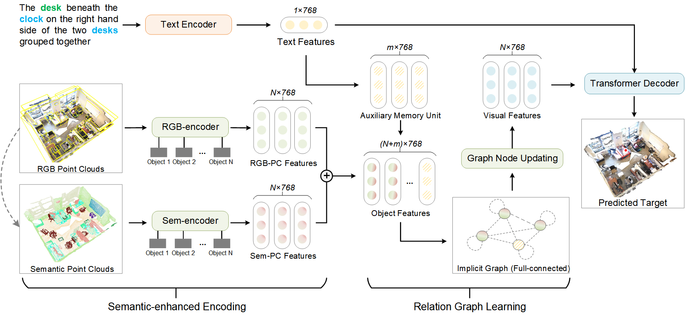

# SeCG：Semantic-Enhanced 3D Visual Grounding via Cross-modal Graph Attention


## Environment
### Requirements
- CUDA: >=11.3  
- Python: >=3.8  
- PyTorch: >=1.12.0  
### Installation
```
pip install h5py
pip install transformers
pip install pickle
pip install tensorboardX

cd external_tools/pointnet2
python setup.py install
```
## Data Preparation
### ScanNet v2
Download the [ScanNet V2](http://www.scan-net.org/) dataset.  
Prepare for ScanNet data and package it into "scannet_00_views.pkl" or "scannet_0x_views.pkl"
```
cd data
python prepare_scannet_data.py --process-only-zero-view [1/0]
```

### Pretrained Model
Download Bert files from [Hugging Face](https://huggingface.co/google-bert/bert-base-uncased/tree/main) or from our [drive](https://drive.google.com/drive/folders/1594AHExOT28CI4QeBKrYnBL-NCk6ak3W?usp=drive_link)  
Download the first encoder checkpoint " ckpt_cls40.pth" from our [drive](https://drive.google.com/drive/folders/1innoC3gyiHxKFK8bWyhofnzgTW_U1_lW?usp=sharing)

## Evaluation
Download SeCG model "ckpt_nr3d.pth" and "ckpt_sr3d.pth" from our [drive](https://drive.google.com/drive/folders/1mrdHeOPHUmDIJrQJrr3pVjQgdMBoOlBI?usp=sharing), put it into "./checkpoints"
```
//nr3d
python evaluation.py 
	--scannet-file ./scannet/scannet_00_views.pkl 
	--refer_test_file ./data/referit3d/nr3d_test.csv 
	--weight ./checkpoints/ckpt_nr3d.pth
	--bert-pretrain-path /pretrained/bert
//sr3d
python evaluation.py 
	--scannet-file ./scannet/scannet_00_views.pkl;./scannet/scannet_0x_views.pkl
	--refer_test_file ./data/referit3d/sr3d_test.csv 
	--weight ./checkpoints/ckpt_sr3d.pth
	--bert-pretrain-path /pretrained/bert
```
## Training
```
//nr3d
python train.py 
	--scannet-file ./scannet/scannet_00_views.pkl 
	--refer_train_file ./data/referit3d/nr3d_train.csv
	--refer_val_file ./data/referit3d/nr3d_test.csv
        --pn-path ./pretrained/ckpt_cls40.pth
	--n-workers 8
        --batch-size 36
	--bert-pretrain-path /pretrained/bert
//sr3d
python train.py  
	--scannet-file ./scannet/scannet_00_views.pkl;./scannet/scannet_0x_views.pkl
	--refer_train_file ./data/referit3d/sr3d_train.csv
	--refer_val_file ./data/referit3d/sr3d_test.csv
        --pn-path ./pretrained/ckpt_cls40.pth
	--n-workers 8
        --batch-size 36
	--bert-pretrain-path /pretrained/bert
```

## Acknowledgment
Our codes references the following codebases. We gratefully thank the authors for their wonderful works.  
[referit3d](https://github.com/referit3d/referit3d), [ScanRefer](https://daveredrum.github.io/ScanRefer/), [MVT-3DVG](https://github.com/sega-hsj/MVT-3DVG), [VQA_ReGAT](https://github.com/linjieli222/VQA_ReGAT)
